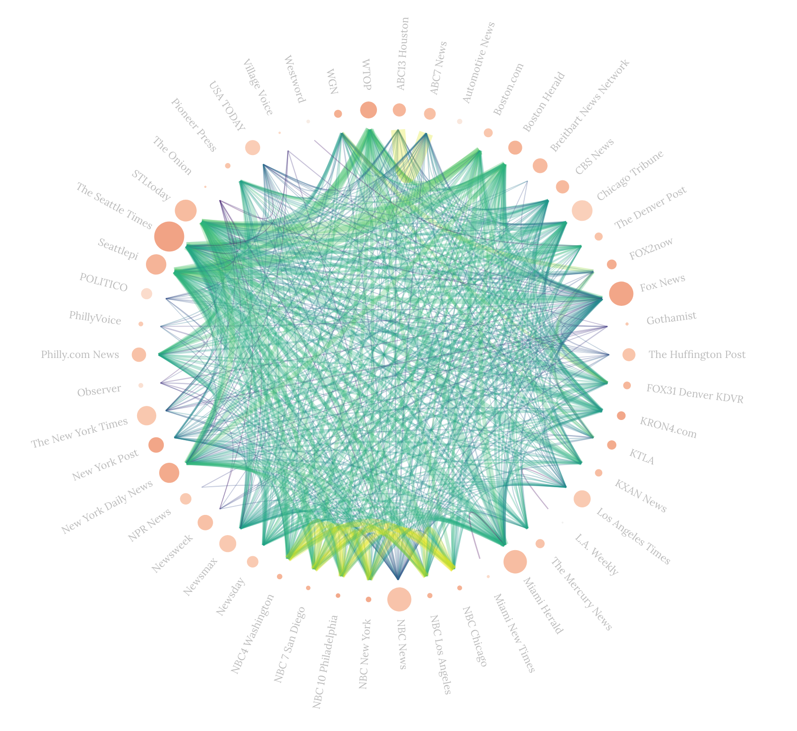

# Life inside an echo chamber
<p align="center"></p>

## Visualizing which news outlets share similar agendas
### I. Initial idea proposal
With the advent of social media and personalized activity feeds like Facebook and Twitter, our news consumption has become increasingly unvaried. This has lead to the phenomenon referred today as the "echo chamber", where one's confirmation bias is reinforced by the constant exposition to pre-selected subsets of news and opinions already in agreement with one's own views. 

By showing the relationships between news sources, in terms of how they share similar stories, sources and political agendas, our objective is to raise the viewer's awareness of the fake idea of consensus and objective truth that could emerge from a stale news diet, and which unfortunately often leads to the propagation of dumb-founded conspiracy theories. 

Better yet, we would like to confront the viewer with their bias and offer a new perspective by allowing them to explore what type of information they would be exposed to inside a different bubble. Often times in today's divided society, people of diverging political opinions do not even share the same basis of facts on which to have a discussion, and getting a glimpse of what the other side is seeing is a first step towards reconciliation. 

There are different paths we would like to explore in order to reach these objectives. At this point in time, potential candidates for our visualization are the following:

1) For a given logical subset of events (based on type of event, virality factor, geography, etc...), display which news outlets reported it and aggregate them into clusters that share similar views and topics. Additionally, allow the user to pre-select and compare interesting use cases, such as the 2016 American Election, worldwide immigration, terrorism and wars, and so forth.

2) For a particular selection of news sources, represent these source's bias in terms of content and opinion on particular topics and categories. Then, compare this with a more neutral sample and / or another sample that would be biased in the opposite way.

3) In addition to point 2), reconstruct what a typical news feed from a set of sources would look like.

4) Display the coverage of certain categories of news and compare it with a more objective measure of the overall importance of such events.

### II. Intermediary follow up

#### Exploratory data analysis :
We used Google BigQuery to access the GDELT 2.0 "Events Mentions" and "GKG" datasets.
At first, we filtered and chose news sources based on their number of articles, which was obviously biased. Then we tried their average article length and also a combination of the two, unfortunately it didn't yield convincing results.

We changed our strategy and decided to scrape 104 american news sources websites from [this page](https://blog.feedspot.com/usa_news_websites/). We matched these with the sources in GDELT and got 83 results. From those, we only kept the top 50 according to the ranking of the article. Then we extracted all mentions from these top 50 sources in the dataset for the last year.

For each pair of sources, we computed the coverage similarity as the ratio of the number of distinct events covered by both and the ones covered by either : size(A & B)/size(A | B) with A the set of events covered by the first source and B the second source.
We are still looking to extract themes and tone information from the gkg dataset. We have already linked it to the articles in our dataset, we just have some trouble extracting it due to its size. Once this is done, we will be able to compare the average tone in each event mention and compute the agreement between two given sources. We also want to be able to filter by themes and compute different graphs.

#### Design :
To display interactions between different news sources, a network was for us the best candidate. At first, we meant to construct a network graph in which each node would correspond to a news source. The edges would represent common coverage of articles about events for connected sources. By fine tuning thresholds and ratios, we wanted to cluster sources together into groups representing a "filtering bubble".
We explored that visualization with plain D3.js and Cytoscape.js but could not end up with a clean display. The nodes and their clusters always seemed to clutter, leading to a poor readability overall.
To fix the cluttering and to have a robust readability, we switched to a radial network with all nodes positioned in a circle. Their position in the space does not mean anything except maybe an eventuel sorting (in our case an alphabetical one), but they can still be grouped to display a hierarchical edge bundling, as we plan to do later. We added circles for each node with a size relative to the number of articles written by that source. We tested first the framework Cytoscape.js to display this circle, but were to constrained to add meaningful interactions with the user. D3.js forced us to code more for the same behaviour, but was way more flexible, so we sticked to it.

At first, our plan was to give the ability to the user to change different parameters, like the time scale of all articles involved in the visualization, or a search-like features for different themes. These filters would have updated the rendering by showing how news sources shared their coverage and tone depending on the context. But this was too demanding in terms of server computing; to allow the filtering system, the server would have to compute in real time a new network, working on a big dataset. 
To avoid having a very slow visualization, we preferred using precomputed data to illustrate our subject. The actual state of the visualization doesn't explain data yet, as we did not choose our stories to tell yet; this is indeed a prototype to be used in different cases.

We allowed a user interaction by adding a hovering system to highlight a given source, the right panel updates such that it displays information about selected node, and the edges connected to it are color-highlighted to be seen easily. At our current state of data analysis, we don't have every attributes we want to display, either in the right panel or as an extra visualization in the main window.

In the future, we would like to add the following features:

- Display more statistics in the right panel (but prefer a clear visualization)
- Try to cluster similar news sources together, and bundle outgoing edges for more clarity
- To color edges depending on the similarity in tone in their articles

## Setup
There are several directories in this repository:

- ```data/``` containing precomputed networks using our data exploration
- ```doc/``` containing a backup of our documentation (for every submission)
- ```visualizations_alternatives/``` other visualizations we explored to display our data
